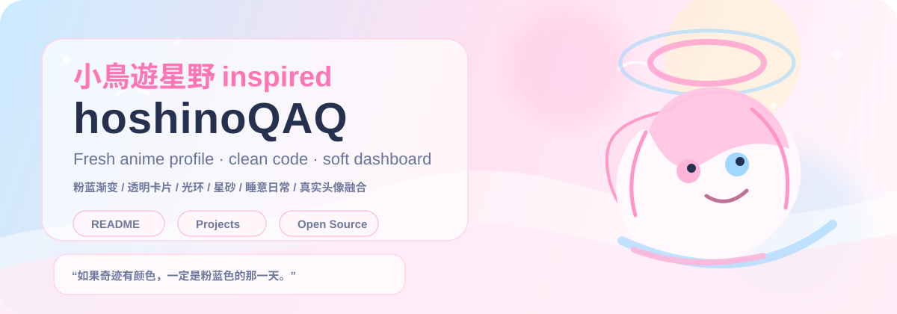

<div align="center">



<br />


# 你好，我是 hoshinoQAQ ✨

**清新粉蓝系 · 开发者主页 · 小鸟游星野灵感主题**


</div>

---

## 🌸 About Me

我想把这个主页做成一个有层次感的个人展示页：上半部分负责建立第一印象，中间部分展示能力和作品，下半部分展示活动、文章、灵感和联系入口。整体视觉参考清新二次元风格，使用浅粉、天空蓝、奶白、透明卡片和星星光效，同时围绕你的头像做柔和的边框和光环感。

```ts
const hoshinoQAQ = {
  style: ["pastel", "fresh anime", "soft blue", "sakura pink"],
  interests: ["coding", "open source", "UI", "anime", "cute tools"],
  mood: "sleepy but building something lovely",
  theme: "Takanashi Hoshino inspired, but original artwork only"
}
```

## 🧭 Profile Dashboard

<div align="center">

| ✨ Focus | 🐳 Now Building | 🎧 Current Vibe | 🌱 Learning |
| --- | --- | --- | --- |
| Clean UI | Cute developer tools | Blue Archive mood | AI / Cloud Native |

</div>

## 🛠️ Tech Stack

<div align="center">


</div>

## 📊 GitHub Stats

<div align="center">


</div>

## 🏆 Achievements

<div align="center">


</div>

## 📌 Featured Projects

<div align="center">

<a href="https://github.com/hoshinoQAQ/hoshinoQAQ">
  
</a>

</div>

> 后续你可以把这里替换成真正想展示的项目。我建议展示 4 个项目：一个主项目、一个工具项目、一个前端作品、一个学习笔记或实验项目。

## 🧩 Project Card Template

<div align="center">

<table>
<tr>
<td width="50%">

### 🌸 hoshino-ui

清新粉蓝风格的 UI 组件库，适合个人主页、仪表盘和小工具。

`React` · `TypeScript` · `Tailwind CSS`

</td>
<td width="50%">

### 🐳 shale-notes

轻量笔记与学习记录项目，整理技术、灵感和日常碎片。

`Next.js` · `MDX` · `Vercel`

</td>
</tr>
<tr>
<td width="50%">

### ✨ cute-tools

一些实用又可爱的开发者小工具合集。

`Python` · `CLI` · `Automation`

</td>
<td width="50%">

### 🎧 hoshino-page

可互动的个人主页雏形，包含粒子、点击音效和音乐按钮。

`HTML` · `CSS` · `JavaScript`

</td>
</tr>
</table>

</div>

## 🐍 Contribution Animation

<div align="center">


</div>

## 🪄 Design Notes

这个主页的视觉重点不是把内容堆满，而是形成层次：第一屏用横幅、头像和打字动画建立印象；第二屏用状态卡、技能栈和统计数据说明能力；第三屏用精选项目和活动展示可信度；最后用贡献图、留言和互动页面入口增加记忆点。

<div align="center">

<a href="./index.html">🌐 Open interactive page draft</a>

<br /><br />


**Made with 💗, ☁️, 🐳 and a little sleepy miracle.**

</div>
