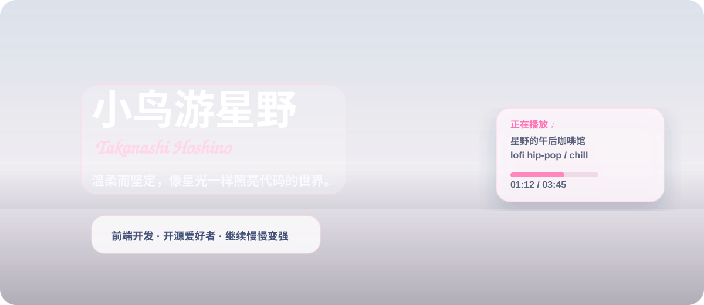
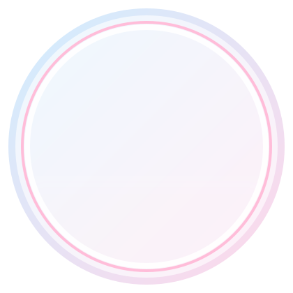
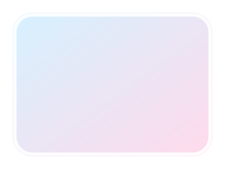
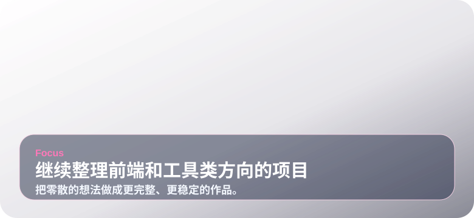
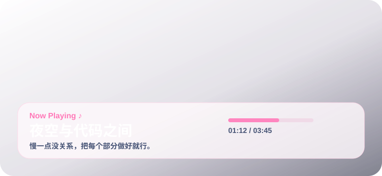
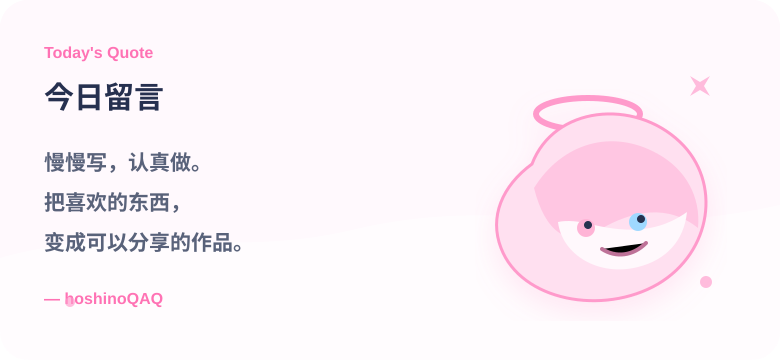
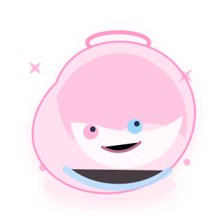

  
    
  
  <h1>hoshinoQAQ</h1>
  
前端开发者 · 开源爱好者 · 喜欢把灵感做成作品

  

    
    
    
  

## 关于我

<table>
<tr>
<td width="58%" valign="top">

- 喜欢把界面做得清爽一点，也喜欢把小细节打磨完整。  
- 主要关注前端开发、组件设计、工具类项目和开源实践。  
- 现在在继续补强工程化、性能优化，以及一些新的语言方向。  
- 平时会把想到的东西做成小项目，再慢慢整理成能长期维护的作品。  

</td>
<td width="42%" align="center" valign="top">
  
</td>
</tr>
</table>

## GitHub Stats

<table>
<tr>
<td width="58%" valign="top">
  
   
  
</td>
<td width="42%" valign="top">
  
    
  
</td>
</tr>
</table>

## 技术栈

  

## 现在在做什么

<table>
<tr>
<td width="50%" align="center" valign="top">
  
   
  <b>继续整理前端和工具类方向的项目</b>
   
  把零散的想法做成更完整、更稳定的作品。
</td>
<td width="50%" align="center" valign="top">
  
   
  <b>写代码的时候喜欢放点轻松的音乐</b>
   
  慢一点没关系，把每个部分做好就行。
</td>
</tr>
</table>

## 精选内容

<table>
<tr>
<td width="33.3%" align="center" valign="top">
  
   
  <b>hoshino-ui</b>
   
  一套偏清爽风格的前端组件整理。
</td>
<td width="33.3%" align="center" valign="top">
  
   
  <b>starry-blog</b>
   
  个人博客与内容整理页面。
</td>
<td width="33.3%" align="center" valign="top">
  
   
  <b>hoshino-cloud</b>
   
  一些轻量、好用的小工具与实验项目。
</td>
</tr>
</table>

## 活动

  

## 今日留言

<table>
<tr>
<td width="65%" valign="middle">

慢慢写，认真做。  
把喜欢的东西，  
变成可以分享的作品。

 
 
— hoshinoQAQ

</td>
<td width="35%" align="center" valign="middle">
  
</td>
</tr>
</table>

  
   
  Made with ♥ by hoshinoQAQ

