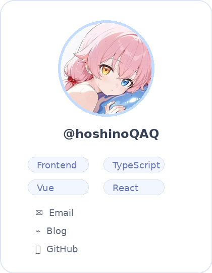

  

<h1 align="center">hoshinoQAQ</h1>

  <b>Full Stack Developer</b> · <b>AI Agent Developer</b> · <b>Low-code Builder</b>

  Building full stack products, AI agent workflows, and low-code solutions. 
  Currently learning ML, IoT, K8s, and DevOps while shipping useful tools and clean experiences.

  
  
  
  

  

---

<table>
<tr>
<td width="28%" valign="top">

 

**Profile**

- 🌏 Earth · UTC+8
- 🧭 Full Stack / AI Agent / Low-code
- ✨ ML / IoT / K8s / DevOps learner
- 🐱 GitHub: [`@hoshinoQAQ`](https://github.com/hoshinoQAQ)

</td>
<td width="72%" valign="top">

## ✦ About Me

- 主要做全栈开发，也在持续做 AI Agent 和 low-code 相关的东西。
- 喜欢把想法整理成能真正落地、能长期维护的产品和工具。
- 关注 Web 工程化、交互体验、自动化工作流和实用型项目。
- 现在正在学习 ML、IoT、K8s、DevOps，以及更多能和产品结合起来的新方向。
- 希望把代码写得更稳，也把体验做得更自然。

 

  
  

</td>
</tr>
</table>

---

## ✦ Contribution Activity

  

---

## ✦ Tech Stack

  

---

## ✦ Pinned Repository

  

---

## ✦ Gallery

<table>
<tr>
<td width="16.6%"></td>
<td width="16.6%"></td>
<td width="16.6%"></td>
<td width="16.6%"></td>
<td width="16.6%"></td>
<td width="16.6%"></td>
</tr>
</table>

---

  

  © 2026 hoshinoQAQ · Built with soft light, clean code, and lots of coffee.

