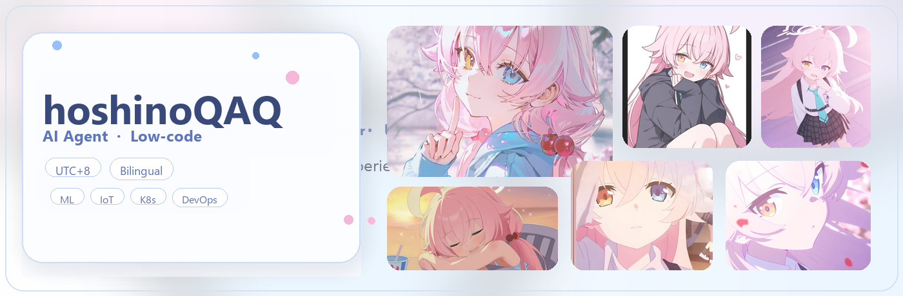
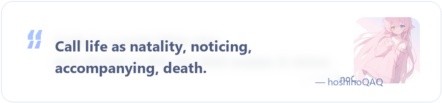

  

<h1 align="center">hoshinoQAQ</h1>

  <b>AI Agent</b> · <b>Low-code</b>

  
  
  
  

  

---

## ✦ About Me

- 代码苦手，最近在学习 ML、IoT、K8s 和 DevOps ing~。

 

  
  

---

## ✦ Contribution Activity

  

---

## ✦ Tech Stack

  

---

## ✦ Pinned Repository

  

---

## ✦ Gallery

<table>
<tr>
<td width="16.6%"></td>
<td width="16.6%"></td>
<td width="16.6%"></td>
<td width="16.6%"></td>
<td width="16.6%"></td>
<td width="16.6%"></td>
</tr>
</table>

---

  

  © 2026 hoshinoQAQ

